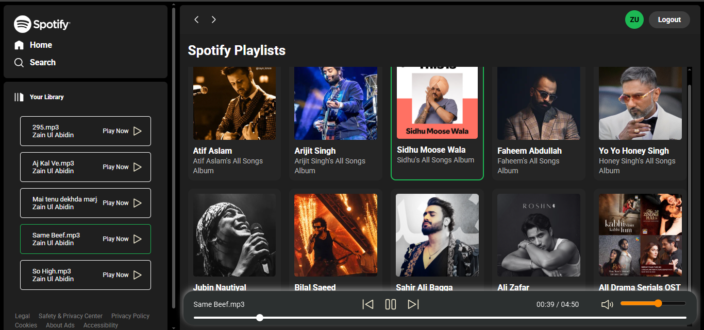
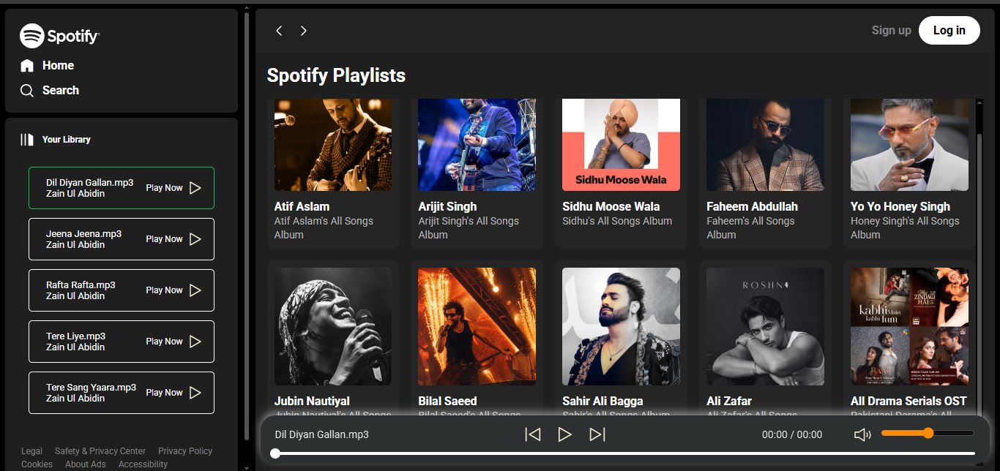

# 🎵 Spotify Web Clone

A responsive Spotify-inspired web music player built using **HTML, CSS, and JavaScript**.

This project recreates the core experience of a modern music streaming interface with playlist browsing, user authentication, profile management, and interactive audio playback controls.

---

## 📸 Project Preview

### 🖥️ Desktop View

### 🎵 Music Player View

---

## ✨ Features

- 🎵 Spotify-inspired user interface
- 📱 Responsive design for desktop and mobile devices
- 🔐 User Sign Up and Log In system
- 👤 User profile management
- 🚪 Logout functionality
- 💾 Authentication state stored using Local Storage
- 🎼 Multiple artist playlists
- ▶️ Play and pause songs
- ⏮️ Previous song control
- ⏭️ Next song control
- 🔊 Volume control
- 🔇 Mute / unmute functionality
- ⏩ Interactive music seekbar
- ⏱️ Real-time song duration display
- 📂 Dynamic song loading from playlist folders
- 🎨 Active playlist and currently playing song highlighting
- 📱 Responsive sidebar with mobile hamburger menu
- 🔔 Popup notifications for user actions

---

## 🎧 Available Playlists

The project currently contains playlists for multiple artists and collections, including:

- Atif Aslam
- Arijit Singh
- Sidhu Moose Wala
- Faheem Abdullah
- Yo Yo Honey Singh
- Jubin Nautiyal
- Bilal Saeed
- Sahir Ali Bagga
- Ali Zafar
- Pakistani Drama OSTs

---

## 🛠️ Technologies Used

| Technology | Purpose |
|------------|---------|
| HTML5 | Website structure |
| CSS3 | Styling and responsive layout |
| JavaScript | Functionality and interactivity |
| Local Storage | User authentication/session data |
| HTML5 Audio API | Music playback |

---

## 🔐 Authentication System

The project includes a simple client-side authentication system.

Users can:

- Create an account
- Log in
- Log out
- View their profile
- Update their name
- Update their password
- Maintain their login session

---

